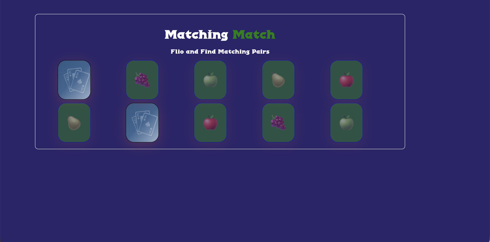

# Matching Card Game

 Memory card game built with HTML, CSS, and JavaScript. The player flips two cards at a time and tries to find all matching pairs before the board is cleared.

 ### Demo

## Overview

This project is a concentration/memory game using fruit emojis. It includes:

- 10 cards total (5 pairs)
- Randomized card placement on each round
- Two-card matching logic
- Temporary delay when a pair is incorrect
- Win alert when all pairs are found

## Gameplay

1. Click a card to reveal its symbol.
2. Click a second card to try to match it with the first.
3. If the symbols match, both cards stay face-up and are marked as matched.
4. If they do not match, both cards flip back after a short pause.
5. Continue until all 5 pairs are found.

## Project Structure

- `index.html` — page structure and card container
- `css/style.css` — styling and layout
- `js/main.js` — game logic and card behavior
- `image/` — assets used by the game
